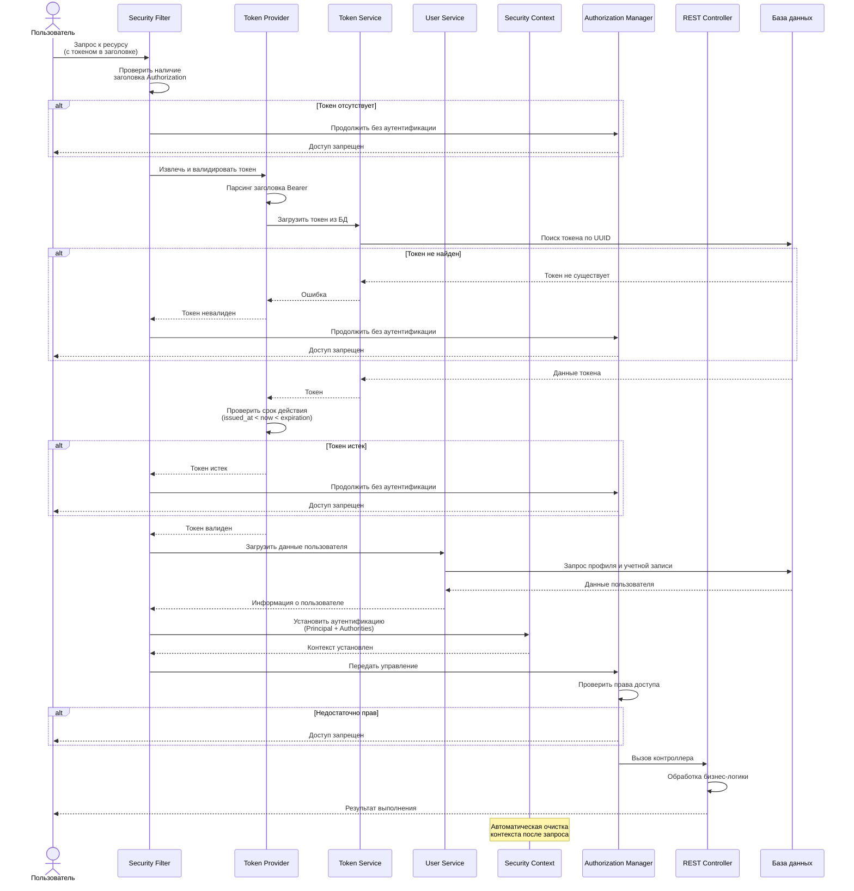

# Проверка доступа по токену

## Обзор

Проверка доступа - это процесс валидации токена при каждом запросе к защищенным ресурсам. Система извлекает токен из заголовка запроса, проверяет его валидность и срок действия, загружает информацию о пользователе и устанавливает контекст безопасности для обработки запроса.

---

## Диаграмма последовательности



---

## Компоненты системы

### Security Filter
**Назначение:** Первичная проверка и обработка аутентификации на каждом запросе

**Ответственность:**
- Перехват всех входящих HTTP запросов
- Проверка наличия токена в заголовке
- Координация процесса валидации
- Установка контекста безопасности
- Передача управления следующему фильтру в цепочке

**Принципы работы:**
- Выполняется один раз на каждый запрос (OncePerRequestFilter)
- Graceful error handling - не прерывает цепочку при ошибках
- Делегирует финальную обработку ошибок Spring Security
- Использует ThreadLocal для изоляции между запросами

---

### Token Provider
**Назначение:** Извлечение и первичная валидация токенов из HTTP запросов

**Ответственность:**
- Извлечение заголовка Authorization из запроса
- Проверка формата Bearer схемы
- Парсинг UUID токена
- Делегирование проверки Token Service

**Проверки:**
- Наличие заголовка Authorization
- Корректный префикс "Bearer "
- Валидность формата UUID
- Существование токена в системе

---

### Token Service
**Назначение:** Работа с токенами в базе данных

**Ответственность:**
- Загрузка токена по UUID
- Проверка существования токена
- Валидация временных рамок (issued_at, expiration)
- Создание новых токенов (при авторизации)

**Валидация срока действия:**
- Токен должен быть уже активен: `issued_at < now`
- Токен не должен истечь: `now < expiration`

---

### User Service
**Назначение:** Работа с данными пользователей

**Ответственность:**
- Загрузка профильной информации пользователя
- Получение данных учетной записи
- Предоставление информации о ролях и правах

**Оптимизация:**
- Возможность параллельной загрузки данных
- Кеширование часто запрашиваемых данных
- Минимизация объема загружаемых данных

---

### Security Context
**Назначение:** Хранение информации об аутентификации для текущего запроса

**Ответственность:**
- ThreadLocal хранилище контекста безопасности
- Предоставление доступа к информации о текущем пользователе
- Автоматическая очистка после завершения обработки запроса

**Содержимое:**
- Principal - объект с данными пользователя
- Authorities - список прав и ролей
- Флаг authenticated - статус аутентификации

---

### Authorization Manager
**Назначение:** Проверка прав доступа к запрашиваемым ресурсам

**Ответственность:**
- Применение правил доступа из конфигурации
- Проверка наличия аутентификации
- Проверка ролей и прав (при использовании RBAC)
- Принятие решения о разрешении/запрете доступа

**Правила доступа:**
- Публичные endpoints - доступны без токена
- Защищенные endpoints - требуют валидную аутентификацию
- Административные endpoints - требуют специальные роли

---

### Database
**Назначение:** Постоянное хранилище данных

**Используемые таблицы:**
- **Токены** - UUID, user_id, issued_at, expiration
- **Пользователи** - профильная информация
- **Учетные записи** - данные для аутентификации, роли

**Оптимизация:**
- Индексы на ID токена для быстрого поиска
- Индексы на expiration для очистки истекших токенов
- Connection pooling для эффективного использования соединений

---

## Цепочка фильтров

### Порядок выполнения

```
HTTP Request
    │
    ▼
┌─────────────────────┐
│ CORS Filter         │ Обработка CORS политик
└──────────┬──────────┘
           ▼
┌─────────────────────┐
│ Security Context    │ Управление контекстом безопасности
│ Persistence Filter  │
└──────────┬──────────┘
           ▼
┌─────────────────────┐
│ Token Authentication│ ◄── НАШ ФИЛЬТР
│ Filter              │     Проверка токена
└──────────┬──────────┘
           ▼
┌─────────────────────┐
│ Authorization       │ Проверка прав доступа
│ Filter              │
└──────────┬──────────┘
           ▼
    REST Controller
```

### Позиционирование
Фильтр проверки токенов размещается перед стандартными фильтрами аутентификации Spring Security, что позволяет перехватить запрос на ранней стадии и установить собственную логику аутентификации.

---

## Процесс валидации

### 1. Извлечение токена
Фильтр проверяет наличие заголовка `Authorization` и извлекает токен после префикса `Bearer `.

### 2. Проверка формата
Валидация формата UUID и корректности структуры токена.

### 3. Загрузка из БД
Поиск токена в базе данных по UUID.

### 4. Проверка срока действия
Сравнение текущего времени с временными метками токена:
- `issued_at` < `now` - токен уже активен
- `now` < `expiration` - токен еще не истек

### 5. Загрузка пользователя
Получение данных пользователя и его учетной записи из базы данных.

### 6. Создание контекста
Формирование объекта аутентификации с информацией о пользователе и его правах.

### 7. Установка в Security Context
Размещение аутентификации в ThreadLocal контексте для доступа из любой точки обработки запроса.

### 8. Проверка прав
Spring Security проверяет соответствие прав пользователя требованиям endpoint'а.

---

## Правила доступа

### Публичные endpoints
Доступны без токена:
- Вход в систему (Login)
- Регистрация
- Документация API

### Защищенные endpoints
Требуют валидный токен:
- Все остальные endpoints по умолчанию
- Доступ к данным пользователей
- Операции с контентом

### Role-based endpoints (опционально)
Требуют специальные роли:
- Административные функции
- Модерация
- Специальные операции

---

## Обработка ошибок

### Graceful Error Handling

**Принципы:**
- Фильтр не прерывает цепочку при ошибках валидации
- Spring Security обрабатывает отсутствие аутентификации
- Логирование ошибок для мониторинга и анализа
- Не раскрывать детали реализации в ответах

**Сценарии:**
- Токен отсутствует → продолжить без аутентификации → 401
- Токен невалиден → продолжить без аутентификации → 401
- Токен истек → продолжить без аутентификации → 401
- Пользователь не найден → продолжить без аутентификации → 401
- Недостаточно прав → 403

---

## Принципы безопасности

### ThreadLocal изоляция
- Контекст безопасности изолирован для каждого потока
- Невозможность утечки данных между запросами
- Автоматическая очистка после завершения обработки

### Stateless архитектура
- Каждый запрос проверяется независимо
- Нет серверных сессий
- Горизонтальная масштабируемость без ограничений

### Bearer Token схема
- Соответствие стандарту OAuth 2.0
- Токен в заголовке, не в URL
- HTTPS обязателен для защиты при передаче

### Проверка на каждом запросе
- Невозможность использовать отозванный токен (после реализации revocation)
- Актуальность прав пользователя
- Свежесть проверки срока действия

---

## Оптимизация производительности

### Кеширование
- Redis для кеша активных токенов
- Снижение нагрузки на основную БД
- TTL кеша совпадает со сроком действия токена

### Индексы базы данных
- По ID токена (primary key)
- По времени истечения
- По ID пользователя

### Параллельная загрузка
- Одновременная загрузка данных пользователя и учетной записи
- Сокращение времени валидации

### Connection Pooling
- Повторное использование соединений с БД
- Настройка размера пула под нагрузку
- Управление таймаутами

---

## Рекомендации

### Безопасность
- HTTPS обязателен для production
- Реализация механизма отзыва токенов
- Привязка токена к IP адресу или устройству
- Rate limiting per token для защиты от злоупотреблений

### Производительность
- Кеширование часто используемых токенов
- Оптимизация запросов к БД
- Мониторинг времени валидации
- Асинхронная загрузка данных где возможно

### Мониторинг
- Отслеживание процента успешных/неудачных проверок
- Измерение времени валидации токена
- Алерты при аномалиях
- Логирование подозрительной активности

---

[← Назад к общей документации](README.md) | [← Процесс авторизации](README_Authorization.md)

---

**Дата обновления:** 15.11.2025  
**Версия:** 3.0
