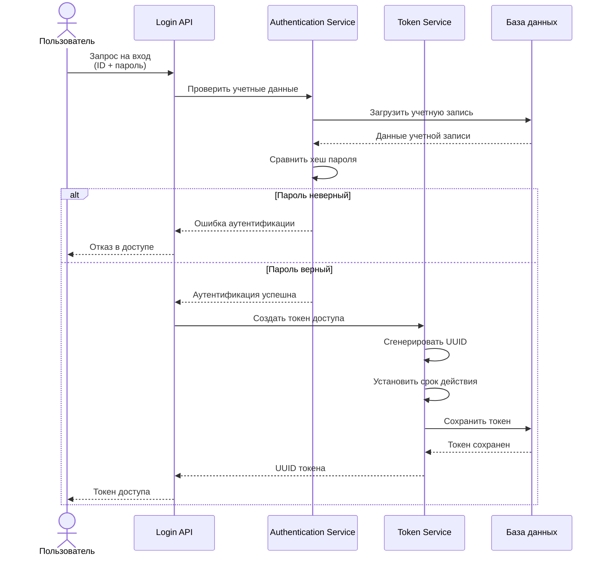

# Процесс авторизации (Login)

## Обзор

Авторизация - это процесс проверки учетных данных пользователя и выдачи токена доступа. Пользователь предоставляет идентификатор и пароль, система проверяет их корректность и при успешной проверке создает токен, который используется для последующих запросов.

---

## Диаграмма последовательности

---

## Компоненты системы

### Login API
**Назначение:** REST endpoint для обработки запросов на вход в систему

**Ответственность:**
- Прием и валидация входных данных
- Координация процесса аутентификации
- Формирование и отправка ответа с токеном

---

### Authentication Service
**Назначение:** Проверка учетных данных пользователя

**Ответственность:**
- Загрузка данных учетной записи из базы данных
- Сравнение предоставленного пароля с сохраненным хешем
- Подтверждение или отклонение попытки входа

**Принципы:**
- Использование криптографического хеширования паролей
- Автоматическое соление для защиты от rainbow tables
- Не раскрывает информацию о причине отказа (ID или пароль неверны)

---

### Token Service
**Назначение:** Управление жизненным циклом токенов доступа

**Ответственность:**
- Генерация уникальных токенов (UUID)
- Установка времени выдачи и истечения
- Сохранение токенов в базе данных
- Связывание токена с пользователем

**Характеристики токена:**
- Уникальный идентификатор (UUID v4)
- Привязка к конкретному пользователю
- Время создания (issued_at)
- Время истечения (expiration)

---

### Database
**Назначение:** Постоянное хранилище данных

**Хранимые данные:**
- **Учетные записи** - ID пользователя, хеш пароля
- **Токены** - ID токена, ID пользователя, временные метки
- **Пользователи** - профильная информация

---

## Процесс работы

### 1. Получение запроса
Клиент отправляет запрос с идентификатором пользователя и паролем.

### 2. Валидация формата
API проверяет корректность формата предоставленных данных.

### 3. Проверка учетных данных
Authentication Service загружает данные учетной записи и сравнивает хеш предоставленного пароля с сохраненным.

### 4. Генерация токена
При успешной аутентификации Token Service создает новый токен:
- Генерируется уникальный UUID
- Устанавливается текущее время как время выдачи
- Вычисляется время истечения (issued_at + срок действия)
- Токен связывается с ID пользователя

### 5. Сохранение токена
Токен сохраняется в базе данных для последующей валидации.

### 6. Возврат токена
UUID токена возвращается клиенту для использования в последующих запросах.

---

## Принципы безопасности

### Хранение паролей
- Пароли никогда не хранятся в открытом виде
- Используется необратимое криптографическое хеширование
- Применяется автоматическое соление
- Настраиваемая сложность хеширования

### Генерация токенов
- UUID v4 обеспечивает высокую энтропию (2^128 возможных значений)
- Невозможность предсказать или подобрать токен
- Каждый токен уникален

### Ограниченный срок действия
- Токены автоматически становятся невалидными после истечения срока
- Снижение рисков от утечки или кражи токена
- Необходимость периодической повторной аутентификации

### Минимизация информации
- При ошибке аутентификации не указывается, что именно неверно
- Предотвращение перечисления пользователей
- Единообразные сообщения об ошибках

---

## Обработка ошибок

### Принципы
- **Graceful degradation** - корректная работа при частичных сбоях
- **Минимизация утечки информации** - не раскрывать детали о причине отказа
- **Логирование** - фиксация всех попыток входа для анализа
- **Мониторинг** - отслеживание подозрительной активности

### Типичные сценарии ошибок
- Неверный формат входных данных
- Несуществующий пользователь
- Неверный пароль
- Недоступность базы данных
- Сбой при генерации токена

---

## Рекомендации

### Безопасность
- Обязательное использование HTTPS для защиты данных при передаче
- Реализация rate limiting для защиты от brute-force атак
- Мониторинг множественных неудачных попыток входа
- Двухфакторная аутентификация для критичных операций

### Производительность
- Оптимизация запросов к базе данных
- Использование индексов для быстрого поиска
- Connection pooling для работы с БД
- Кеширование данных учетных записей при необходимости

### Мониторинг
- Отслеживание количества попыток входа (успешных и неудачных)
- Измерение времени отклика endpoint'а
- Алерты при аномальной активности
- Логирование для аудита безопасности

---

[← Назад к общей документации](README.md) | [Проверка доступа →](README_Access_Control.md)

---

**Дата обновления:** 15.11.2025  
**Версия:** 3.0
