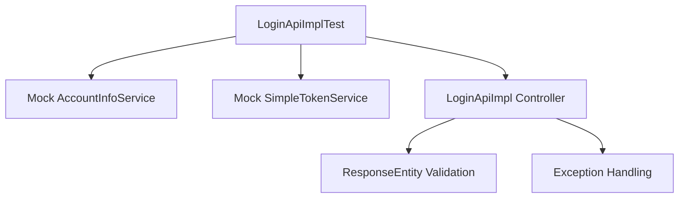
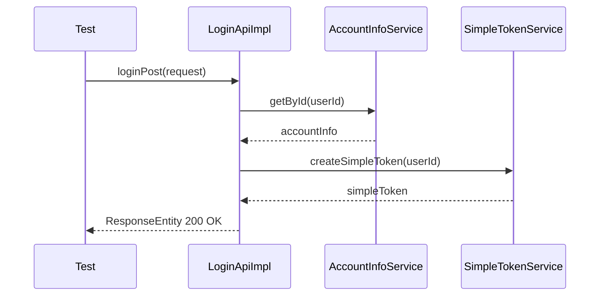
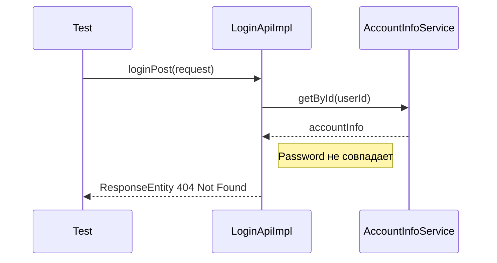
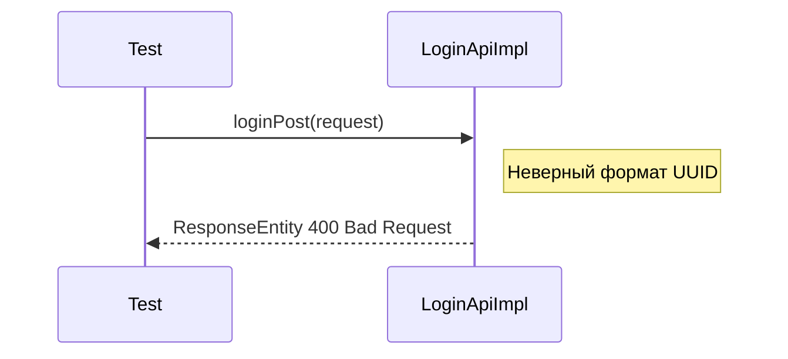

# Дизайн-документ для интеграционных тестов LoginApiImpl

## Описание разрабатываемой функциональности
Разработка интеграционных тестов для контроллера авторизации `LoginApiImpl` с использованием моков для замены работы с БД. Тесты покрывают основные сценарии: успешная авторизация, неверные учетные данные, неверный формат UUID и ошибки сервиса.

## Ограничения функциональности
- Использование Spring Test ограничено базовыми аннотациями
- Мокирование сервисов `AccountInfoService` и `SimpleTokenService`
- Покрытие только основных HTTP статусов (200, 400, 404, 503)
- Без проверки логирования и PasswordEncoder
- Без проверки создания и возврата токена

## Схемы Mermaid

### Диаграмма компонентов тестов

### Диаграмма последовательности успешной авторизации

### Диаграмма последовательности неверных учетных данных

### Диаграмма последовательности неверного формата UUID

## Ключевые сущности
- **LoginApiImplTest**: Основной класс тестов
- **Mock AccountInfoService**: Мок сервиса учетных записей
- **Mock SimpleTokenService**: Мок сервиса токенов
- **LoginPostRequest**: DTO запроса авторизации
- **LoginPost200Response**: DTO успешного ответа

## Ключевые директории и файлы

### Создаваемые файлы:
- `src/test/java/com/highload/architect/soc/network/api/LoginApiImplTest.java` - Основной класс тестов (JUnit + Mockito)
- `src/test/resources/application-test.properties` - Конфигурация для тестового окружения

### Изменяемые файлы:
- `pom.xml` - Проверка наличия зависимостей для тестирования (JUnit, Mockito)
- `.gitignore` - Добавление исключений для тестовых артефактов

## Тестовые сценарии
1. **Успешная авторизация**: Возврат HTTP 200 с токеном
2. **Неверные учетные данные**: Возврат HTTP 404
3. **Неверный формат UUID**: Возврат HTTP 400
4. **Ошибка сервиса**: Возврат HTTP 503

## Используемые технологии
- JUnit 5 для структуры тестов
- Mockito для мокирования зависимостей
- Spring Test для интеграционного тестирования
- AssertJ для проверок утверждений
